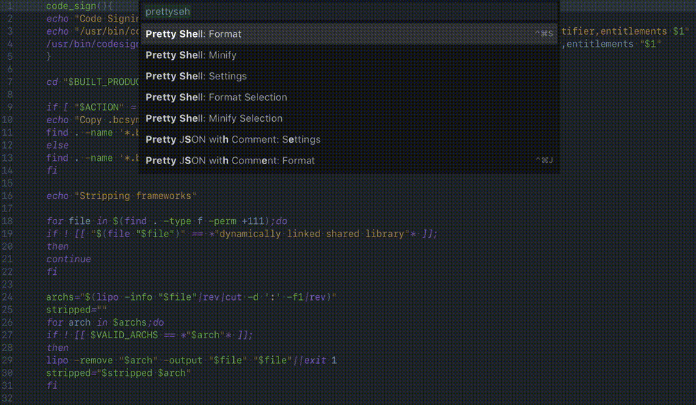

## [🐚 Pretty Shell](https://packagecontrol.io/packages/Pretty%20Shell)

> Shell Script Formatter / Syntax Checker for Sublime Text 3<br>
> For Every Shell Scripters.

<table width="100%" style="border-spacing: 0px;">
<tr>
    <th><b>🚅 Blazingly Fast Formatting / Minifying</b></th>
    <th><b><a href="https://github.com/mvdan/sh#replacing-bash--n">🚦 Syntax Checking</a></b></th>
</tr>
<tr>
    <td colspan="2" style="padding: 0px; margin: 0px;">
        
    </td>
</tr>
</table>

- Recommended to use this plugin with: [SublimeLinter-shellcheck](https://packagecontrol.io/packages/SublimeLinter-shellcheck)

### 📦 Install
1. <kbd>Package Control: Install Package</kbd>
2. Type <kbd>PrettyShell</kbd> and Install
3. You're ready to script.

>    #### Manual Install
>    ```bash
>    # 1. Clone this repository as shown below
>    # 2. You're ready (Restart Sublime Text if the package is not recognized)
>
>    # Example on macOS (It should work on Linux / Windows too, follow the same steps with the equivalent clone target directory)
>    git clone https://github.com/aerobounce/Sublime-Pretty-Shell.git "$HOME/Library/Application Support/Sublime Text 3/Packages/Pretty Shell"
>    ```

### ⚠️ Dependency
Pretty Shell **does not work without `shfmt`** as this package utilizes the formatter.<br>
It is available via several package managers, and in pre-built binary form.<br>

- **macOS**
    - [Homebrew](https://formulae.brew.sh/formula/shfmt)
    - [MacPorts](https://ports.macports.org/port/shfmt/summary)
- **\*nix**
    - [Linuxbrew](https://github.com/Homebrew/linuxbrew-core/blob/master/Formula/shfmt.rb)
    - [Alpine](https://pkgs.alpinelinux.org/packages?name=shfmt)
    - [Arch](https://www.archlinux.org/packages/community/x86_64/shfmt/)
    - [FreeBSD](https://www.freshports.org/devel/shfmt)
    - [NixOS](https://github.com/NixOS/nixpkgs/blob/HEAD/pkgs/tools/text/shfmt/default.nix)
    - [Snapcraft](https://snapcraft.io/shfmt)
    - [Void](https://github.com/void-linux/void-packages/blob/HEAD/srcpkgs/shfmt/template)
- **Windows**
    - [Scoop](https://github.com/ScoopInstaller/Main/blob/HEAD/bucket/shfmt.json)
- **Pre-Built Binary Releases**
    - [mvdan/sh/releases](https://github.com/mvdan/sh/releases)

> If Sublime Text does not recognize `shfmt`, specify the absolute path in the settings:
>
>    ```JavaScript
>    "shfmt_bin_path": "Absolute Path to shfmt"
>    ```

### 📝 Available Commands

| Caption                                   | Command                         | Default Key Bindings                                              |
| ----------------------------------------- | ------------------------------- | ----------------------------------------------------------------- |
| <kbd>Pretty Shell: Format</kbd>           | `pretty_shell`                  | <kbd>cmd</kbd> or <kbd>alt</kbd> + <kbd>ctrl</kbd> + <kbd>s</kbd> |
| <kbd>Pretty Shell: Format Selection</kbd> | `pretty_shell_selection`        | None                                                              |
| <kbd>Pretty Shell: Minify</kbd>           | `pretty_shell_minify`           | None                                                              |
| <kbd>Pretty Shell: Minify Selection</kbd> | `pretty_shell_minify_selection` | None                                                              |

- **Command** is the name of the command you can use for **Key-Bindings**.
- Be aware that any manual modifications with `Format Selection` commands might be lost upon saving a file if `format_on_save` is `true`, which it is by default.

### 🛠 Default Settings

```javascript
// shfmt settings
"simplify": true,   // Simplify the code
"language": "bash", // Language variant to parse (bash / posix / mksh)
"indent": 4,        // 0 for tabs
"binop": false,     // Binary operators such as '&&' and '|' may start a line
"switchcase": true, // Indent switch cases
"rediop": true,     // Redirect operators will be followed by a space
"align": false,     // Keep column alignment paddings
"minify": false,    // Minify program to reduce its size

// Pretty Shell settings
"format_selection_only": false, // Entire file will be used if no selections
"format_on_save": true,
"shfmt_bin_path": "shfmt"
```

### ☑️ Todo

- [ ] Real-time formatting / syntax checking for fun?

### 🤝 Thank you

- [dzhibas/SublimePrettyJson](https://github.com/dzhibas/SublimePrettyJson) — Inspired by this project
- [mvdan/sh](https://github.com/mvdan/sh) — Pretty Shell is powerd by shfmt, the quality formatter
- [realm/strip-frameworks.sh](https://github.com/realm/realm-cocoa/blob/master/scripts/strip-frameworks.sh) — Script used in the demo gif
